# 👋 Olá, Mundo! 🌎

  

  

## 🪪 Quem sou eu?

  Sou <b>Alex Machado Ribeiro</b> — desenvolvedor e instrutor técnico. Trabalho com projetos práticos e material didático, com foco em Python (Jupyter Notebooks, IA/ML, visão computacional), Java e desenvolvimento web com Flask e Django. Tenho graduação em Bacharel em Sistemas de Informação. Trabalho como professor e desenvolvedor da área há mais de 20 anos. Atualmente sou instrutor de TI dos cursos de qualificação e técnico do SENAI-DF de programação.

  Publico conteúdos e repositórios voltados ao aprendizado prático: exercícios, tutoriais e projetos demonstráveis que conectam teoria e aplicação. Entre meus trabalhos estão sistemas de reconhecimento facial, aplicações de OCR, extração de texto e coleções de notebooks para ensino. Além disso, também sou escritor, com um livro publicado na loja da Amazon, em versões e-book e capa comum.

## 🎓 Formação

<a href="https://shields.io/badges">
  
   
  
   
  
   
  
</a>

## 👨‍💼 Ocupação

### Atual

### Anteriores

<a href="https://shields.io/badges">
  
   
  
   
  
   
  
   
  
   
  
   
  
</a>

## 💻 Habilidades

### Programação

### Frameworks

### Análise de Dados

### Ferramentas

### IA

## 📜 Certificações

  
    
  

## 📖 Livros publicados

  

    Mais recentemente, também publiquei na Amazon o meu primeiro livro <a href="https://www.amazon.com.br/Dossi%C3%AA-Python-Zero-Projeto-Flask-ebook/dp/B0HB98TZBR/ref=tmm_kin_swatch_0?_encoding=UTF8&dib_tag=se&dib=eyJ2IjoiMSJ9.vD_tRVW_joAzf7agUEkpUQ.Xjin22abUCqijY8A6E0sH4X5bh44E60OG1pDAETHUHw&qid=1785261162&sr=8-1" target="_blank"><b>Dossiê Python: Do Zero ao Projeto com Flask</b></a>, destinado para iniciantes que queiram aprender lógica de programação, mas que também gostariam de, logo em seguida, desenvolver um projeto para chamar de seu. Agradeço desde já a todos que me apoiarem e comprarem meu livro, pois foi feito com muito carinho e dedicação.

  O livro está disponível em e-book, kindle unlimited e capa comum <a href="https://www.amazon.com.br/Dossi%C3%AA-Python-Zero-Projeto-Flask-ebook/dp/B0HB98TZBR/ref=tmm_kin_swatch_0?_encoding=UTF8&dib_tag=se&dib=eyJ2IjoiMSJ9.vD_tRVW_joAzf7agUEkpUQ.Xjin22abUCqijY8A6E0sH4X5bh44E60OG1pDAETHUHw&qid=1785261162&sr=8-1" target="_blank">neste link</a>.

> [!TIP]
> A versão capa comum do livro se encontra atualmente 33 reais mais barato que o de lançamento! 😉

## 👨‍💻 Linguagens mais usadas

  <a href="https://github.com/stats-organization/github-stats-extended" target="_blank">
    
    <!--  -->
    
    <!--  -->
  </a>

<!-- ## 📈 Estatísticas do meu GitHub

  

 -->

## 👨‍🏫 Guias Rápidos

## 🧑‍🎓 Repositórios das turmas atuais

---

## 🎮 Bomberman

<!--  -->

<!--
## 👨‍💻 Meu status

 -->

<!--
**alexmachadoribeiro/alexmachadoribeiro** is a ✨ _special_ ✨ repository because its `README.md` (this file) appears on your GitHub profile.

Here are some ideas to get you started:

- 🔭 I’m currently working on ...
- 🌱 I’m currently learning ...
- 👯 I’m looking to collaborate on ...
- 🤔 I’m looking for help with ...
- 💬 Ask me about ...
- 📫 How to reach me: ...
- 😄 Pronouns: ...
- ⚡ Fun fact: ...
-->
