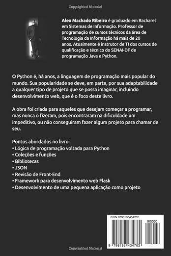

  

  

# 👋 Olá, Mundo! 🌎

  Sou <b>Alex Machado Ribeiro</b> — desenvolvedor e instrutor técnico. Trabalho com projetos práticos e material didático, com foco em Python (Jupyter Notebooks, IA/ML, visão computacional), Java e desenvolvimento web com Flask e Django. Tenho graduação em Bacharel em Sistemas de Informação. Trabalho como professor e desenvolvedor da área há mais de 20 anos. Atualmente sou instrutor de TI dos cursos de qualificação e técnico do SENAI-DF de programação.

  Publico conteúdos e repositórios voltados ao aprendizado prático: exercícios, tutoriais e projetos demonstráveis que conectam teoria e aplicação. Entre meus trabalhos estão sistemas de reconhecimento facial, aplicações de OCR, extração de texto e coleções de notebooks para ensino. Além disso, também sou escritor, com um livro publicado na loja da Amazon, em versões e-book e capa comum.

## 📖 Livros publicados

  

    Mais recentemente, também publiquei na Amazon o meu primeiro livro <a href="https://www.amazon.com.br/Dossi%C3%AA-Python-Zero-Projeto-Flask-ebook/dp/B0HB98TZBR/ref=tmm_kin_swatch_0?_encoding=UTF8&dib_tag=se&dib=eyJ2IjoiMSJ9.vD_tRVW_joAzf7agUEkpUQ.Xjin22abUCqijY8A6E0sH4X5bh44E60OG1pDAETHUHw&qid=1785261162&sr=8-1" target="_blank"><b>Dossiê Python: Do Zero ao Projeto com Flask</b></a>, destinado para iniciantes que queiram aprender lógica de programação, mas que também gostariam de, logo em seguida, desenvolver um projeto para chamar de seu. Agradeço desde já a todos que me apoiarem e comprarem meu livro, pois foi feito com muito carinho e dedicação.

  O livro está disponível em e-book, kindle unlimited e capa comum <a href="https://www.amazon.com.br/Dossi%C3%AA-Python-Zero-Projeto-Flask-ebook/dp/B0HB98TZBR/ref=tmm_kin_swatch_0?_encoding=UTF8&dib_tag=se&dib=eyJ2IjoiMSJ9.vD_tRVW_joAzf7agUEkpUQ.Xjin22abUCqijY8A6E0sH4X5bh44E60OG1pDAETHUHw&qid=1785261162&sr=8-1" target="_blank">neste link</a>.

<!-- Mais recentemente, também publiquei na Amazon o meu primeiro livro [**Dossiê Python: Do Zero ao Projeto com Flask**](https://www.amazon.com.br/s?k=dossi%C3%AA+python&crid=26EG7ZELF09OF&sprefix=%2Caps%2C283&ref=nb_sb_ss_recent_1_0_recent), destinado para iniciantes que queiram aprender lógica de programação, mas que também gostariam de, logo em seguida, desenvolver um projeto para chamar de seu. O livro foi publicado em duas versões: [e-book](https://www.amazon.com.br/Dossi%C3%AA-Python-Zero-Projeto-Flask-ebook/dp/B0HB98TZBR/ref=sr_1_2?crid=26EG7ZELF09OF&dib=eyJ2IjoiMSJ9.QrehVcqAgY5c9tL89dhi6jSNgs0-0Zv3Z0NOCOKv4bk.9B5GIyOk688w3PNSorAI4cnuD9v1KrgLjqIMKJa-qgE&dib_tag=se&keywords=dossi%C3%AA+python&qid=1784987724&sprefix=%2Caps%2C283&sr=8-2) e [livro físico capa comum](https://www.amazon.com.br/dp/B0HBGY2NPF/ref=sr_1_1?crid=26EG7ZELF09OF&dib=eyJ2IjoiMSJ9.QrehVcqAgY5c9tL89dhi6jSNgs0-0Zv3Z0NOCOKv4bk.9B5GIyOk688w3PNSorAI4cnuD9v1KrgLjqIMKJa-qgE&dib_tag=se&keywords=dossi%C3%AA+python&qid=1784987724&sprefix=%2Caps%2C283&sr=8-1&ufe=app_do%3Aamzn1.fos.2cac4462-e4ae-4f90-bce2-96d9085be8be). -->

## 🧑‍💻 Linguagens com que mais trabalho

  

<!-- https://github-stats-extended.vercel.app/api/top-langs?username=dev-alexmachado&layout=pie&langs_count=8&theme=date_night -->

## 🪪 Estatísticas do meu GitHub

  

<!-- https://github-stats-extended.vercel.app/api?username=dev-alexmachado&rank_icon=percentile&show=reviews,discussions_started,discussions_answered,prs_merged,prs_merged_percentage,prs_commented,prs_reviewed,issues_commented&show_icons=true&include_all_commits=true&theme=dark&locale=pt-br&hide_border=true -->

## 💻 Minhas tecnologias

  
  
  
  
  
  
  
  
  
  
  
  
  
  
  
  
  
  
  
  
  
  
  
  
  
  
  
  
  
  
  
  
  
  
  
  
  
  
  
  
  
  
  
  
  
  
  
  
  
  
  

### 

<!-- 

###

<picture>
  <source media="(prefers-color-scheme: dark)" srcset="https://raw.githubusercontent.com/alexmachadoribeiro/alexmachadoribeiro/output/pacman-contribution-graph-dark.svg">
  <source media="(prefers-color-scheme: light)" srcset="https://raw.githubusercontent.com/alexmachadoribeiro/alexmachadoribeiro/output/pacman-contribution-graph.svg">
  
</picture>

### -->

<!--
## 👨‍💻 Meu status

 -->

<!--
**alexmachadoribeiro/alexmachadoribeiro** is a ✨ _special_ ✨ repository because its `README.md` (this file) appears on your GitHub profile.

Here are some ideas to get you started:

- 🔭 I’m currently working on ...
- 🌱 I’m currently learning ...
- 👯 I’m looking to collaborate on ...
- 🤔 I’m looking for help with ...
- 💬 Ask me about ...
- 📫 How to reach me: ...
- 😄 Pronouns: ...
- ⚡ Fun fact: ...
-->
